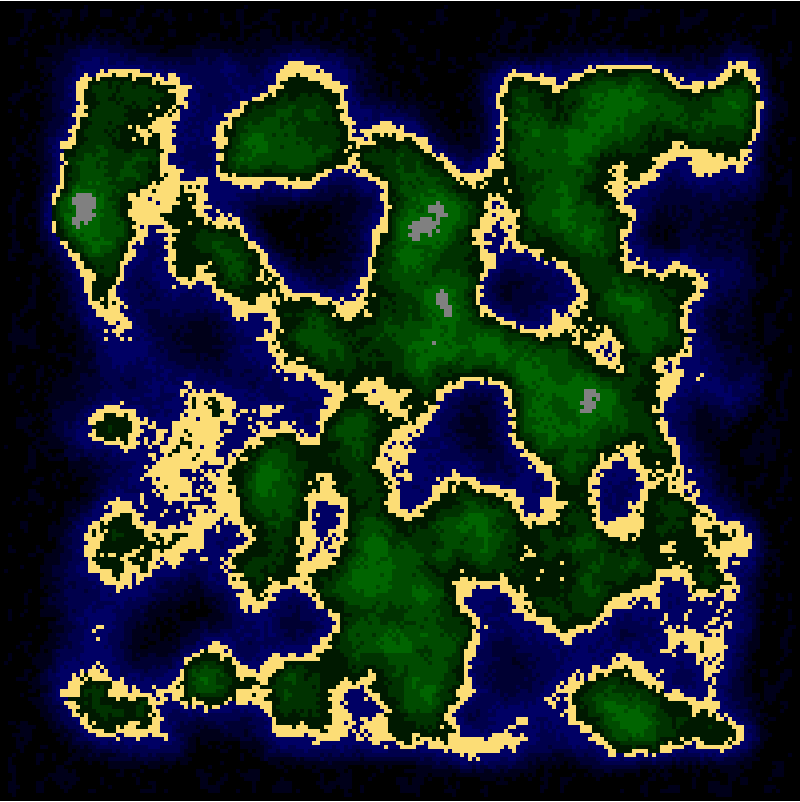

# 🎓 Проект "Генерация ландшафта"

## 👤 Информация
**Исполнитель:** _Святослав К._  
**Курс**: _[Web-разработка на JavaScript](https://easypro.academy/courses/javascript)_  
**Название проекта:** _Генератор Ландшафта_

---

## 📌 Описание проекта

Данный проект позволяет создавать 2D-ландшафты прямо на веб-странице. В основе работы этого проекта лежит алгоритм процедурной генерации.

В процессе разработке данного проекта мы научились работать с холстом canvas в HTML, укрепили навыки работы с двумерными массивами. Также освоили интересные алгоритмы. 

---

## 🚀 Функциональность
- Проект позволяет сгенерировать новый ландшафт при нажатии на кнопку.
- Есть возможность менять масштаб создаваемого ландшафта путем ввода числа в специальное поле на странице.

---

## 🛠️ Используемые технологии
| Технология / Инструмент | Назначение |
| - | - |
| JavaScript | Основной язык разработки |
| HTML, CSS | Языки для оформления страницы |

---

## 🖼️ Скриншоты

  
  

---

## 📞 Контакты

### <strong> <a href="https://easypro.academy/courses/javascript" target="_blank"> Записаться на курс "Web-разработка на JavaScript" </a></strong>
Научим создавать интерактивные сайты: верстка, динамический контент и основы frontend-разработки.

&nbsp;&nbsp;

###  🌐 <a href="https://easypro.academy/" target="_blank">easypro.academy</a>

### 📱  <strong>+7 (499) 283-17-14</strong>

&nbsp;&nbsp;

